# Trippin — Implementation Plan

> References:
> - [UX Spec](file:///C:/Users/rafay/.gemini/antigravity-ide/brain/34f5bc9e-2305-4141-b124-3d1c0902c7cf/trippin_ux_spec.md)
> - [Project Status Report](file:///C:/Users/rafay/.gemini/antigravity-ide/brain/34f5bc9e-2305-4141-b124-3d1c0902c7cf/project_status.md)

### Decisions Locked
- Currency: PKR hardcoded (₨ prefix)
- Expense categories: Deferred
- Trip model: Single active trip only
- Haptics: Subtle (iOS-style)
- Onboarding walkthrough: Deferred (after app is finished)
- Trip cover/theme: Deferred

---

## Phase Overview

```mermaid
gantt
    title Implementation Phases
    dateFormat X
    axisFormat %s
    section UI Restructure
    P1 - Core Flow & Routing       :p1, 0, 3
    P2 - Home Hub Redesign         :p2, after p1, 2
    P3 - Trip Screen Overhaul      :p3, after p2, 5
    P4 - Expense Sheet Redesign    :p4, after p3, 3
    section Connection & Closure
    P5 - Join & Connection Polish  :p5, after p4, 3
    P6 - Closure & History         :p6, after p5, 3
    section Polish
    P7 - Animations & Polish       :p7, after p6, 3
    section Multi-Device
    P8 - Sync Validation & Settlement :p8, after p7, 5
```



---

## Phase 1: Core Flow Restructure

> **Goal:** Fix the app's navigation backbone. Active trip = locked session. Persistent profile. Clean routing.

This phase changes HOW the app decides what screen to show. It's foundational — everything else builds on top.

### Step 1.1 — Persistent Profile Storage

Store the user's name locally so it auto-fills on Start Trip / Join Trip.

#### [NEW] `lib/core/services/profile_service.dart`
- Simple Hive-backed key-value store for user profile
- Methods: `getSavedName()`, `setSavedName(String name)`, `getDeviceRole()`, `setDeviceRole(String? role)`
- Initialize in `StorageService.initialize()`

#### [MODIFY] [storage_service.dart](file:///d:/Vs%20Code%20Flutter/trippin/trippin/lib/core/services/storage_service.dart)
- Open a new Hive box `profileBox` during init
- Add profile accessors or delegate to `ProfileService`

#### [NEW] `lib/core/riverpod/profile_provider.dart`
- Expose `savedNameProvider` and `deviceRoleProvider`
- Used by Start Trip and Join Trip screens for auto-fill

### Step 1.2 — Device Role Persistence on Trip Model

Track whether this device is host or guest for crash recovery.

#### [MODIFY] [trip.dart](file:///d:/Vs%20Code%20Flutter/trippin/trippin/lib/core/models/trip.dart)
- Add `@HiveField(10) final String? deviceRole` — values: `'host'`, `'guest'`, `null`
- Update `TripAdapter.read()` and `write()` for the new field
- Update `copyWith()`, `create()` factory, `fromJson`/`toJson`

#### [MODIFY] [trip_provider.dart](file:///d:/Vs%20Code%20Flutter/trippin/trippin/lib/core/riverpod/trip_provider.dart)
- `createTrip()` → set `deviceRole: 'host'`
- Add method to set role to `'guest'` when joining a trip via connection

### Step 1.3 — App-Level Active Trip Routing

Move the "active trip?" check from HomeScreen to the app root.

#### [MODIFY] [main.dart](file:///d:/Vs%20Code%20Flutter/trippin/trippin/lib/main.dart)
- Replace `home: const HomeScreen()` with a new `AppShell` widget
- `AppShell` watches `tripControllerProvider`:
  - Trip exists → `TripScreen`
  - No trip → `HomeScreen` (which now ONLY shows EmptyHomeScreen)

#### [MODIFY] [home_screen.dart](file:///d:/Vs%20Code%20Flutter/trippin/trippin/lib/features/home/home_screen.dart)
- Remove the `tripAsync.when` routing logic
- HomeScreen now ALWAYS shows the Home Hub (EmptyHomeScreen)
- It's only displayed when AppShell determines there's no active trip

### Step 1.4 — Navigation from Trip Screen

Add a way to reach History/Settings/About from within the Trip Screen without leaving the trip.

#### [MODIFY] [trip_screen.dart](file:///d:/Vs%20Code%20Flutter/trippin/trippin/lib/features/trip/trip_screen.dart)
- Add a navigation `Drawer` with links to: Trip History, Settings, About, and Finish Trip (host only)
- Replace the current AppBar refresh button with a hamburger icon (leading) and overflow menu (trailing)

### Acceptance Criteria — Phase 1
- [ ] App launches directly to Trip Screen when an active trip exists
- [ ] App launches to Home Hub when no active trip exists
- [ ] Owner name auto-fills from saved profile on Start Trip / Join Trip
- [ ] Trip model stores device role (host/guest) and survives restart
- [ ] Navigation drawer from Trip Screen opens History, Settings, About
- [ ] Back button on Trip Screen does NOT navigate to Home Hub

---

## Phase 2: Home Hub Redesign

> **Goal:** Make the Home Hub look and feel premium. Clear CTAs, fun copy, no clutter.

### Step 2.1 — Redesign EmptyHomeScreen

#### [MODIFY] [empty_home_screen.dart](file:///d:/Vs%20Code%20Flutter/trippin/trippin/lib/features/home/empty_home_screen.dart)
- New layout per UX spec §3.1:
  - App icon/logo area with "TRIPPIN" display text
  - Tagline: "Split bills, not friendships"
  - Full-width **Start a Trip** button (Electric Purple)
  - Full-width **Join a Trip** outlined button (Neon Cyan)
  - "or" divider
  - Pill row: History, Settings, About
  - Footer: "Works offline. No sign-up needed."
- Remove `onCreateSampleTrip` callback and button
- Remove the existing `PrimaryButton` for Start Trip, replace with custom styled button

#### [MODIFY] [home_screen.dart](file:///d:/Vs%20Code%20Flutter/trippin/trippin/lib/features/home/home_screen.dart)
- Remove `_createSampleTrip()` method
- Clean up to only handle Home Hub navigation actions

#### [MODIFY] [action_pill.dart](file:///d:/Vs%20Code%20Flutter/trippin/trippin/lib/features/home/components/action_pill.dart)
- Polish pill styling: add subtle border, hover/press feedback

### Step 2.2 — Redesign Start Trip Screen

#### [MODIFY] [start_trip_screen.dart](file:///d:/Vs%20Code%20Flutter/trippin/trippin/lib/features/start_trip/start_trip_screen.dart)
- New layout per UX spec §3.2:
  - "Name your adventure" section label
  - Trip Name field with placeholder examples ("Khanpur Dam Weekend")
  - "What should we call you?" section label
  - Your Name field — **auto-filled from `ProfileService`**
  - Info card explaining host role (casual copy, lightbulb icon)
  - "Let's Go!" full-width primary button
- On create: save name to `ProfileService`, set `deviceRole: 'host'`
- Remove dry description text ("Create your trip and become the host...")
- After creation, push directly to TripScreen (or let AppShell handle the re-route)

### Acceptance Criteria — Phase 2
- [ ] Home Hub matches UX spec layout with new copy and styling
- [ ] No "Create sample trip" button visible
- [ ] Start Trip screen has fun placeholders and auto-fills name
- [ ] Profile name is saved and persists across trips

---

## Phase 3: Trip Screen Overhaul

> **Goal:** Transform the 750-line monolith into a tabbed, component-based, premium trip experience. This is the biggest phase.

### Step 3.1 — Component Decomposition

Break `trip_screen.dart` into manageable pieces. Create these new files:

#### [NEW] `lib/features/trip/components/trip_header.dart`
- Trip title (large heading)
- Subtitle: "Started X ago • N members"
- Total spent card with animated count-up
- Personal balance ("Your balance: +₨ X" / "-₨ X" colored green/red)
- Source data from existing providers

#### [NEW] `lib/features/trip/components/member_avatar_strip.dart`
- Horizontal scrollable row of circular avatars
- Each avatar: member initial + assigned color from the palette
- `+ Add` button at the end (host only, hidden when closed)
- Tapping avatar shows quick popover with member's balance

#### [NEW] `lib/features/trip/components/trip_tabs.dart`
- `TabBar` with 3 tabs: Expenses, Balances, Activity
- Custom styling: Electric Purple selected indicator, muted unselected

#### [MODIFY] [expenses_list.dart](file:///d:/Vs%20Code%20Flutter/trippin/trippin/lib/features/trip/components/expenses_list.dart)
- Redesign expense cards per UX spec §3.4.3:
  - Payer color bar on left edge
  - Amount right-aligned, prominent
  - Beneficiary dots (small colored circles)
  - Time ago (relative timestamp)
  - Sync badge (guest only)
- Add `Dismissible` wrapper for swipe-to-edit (right) and swipe-to-delete (left) — host only
- PKR formatting with ₨ prefix

#### [MODIFY] [balances_list.dart](file:///d:/Vs%20Code%20Flutter/trippin/trippin/lib/features/trip/components/balances_list.dart)
- Redesign per UX spec §3.4.4:
  - Horizontal balance bars (green right = positive, red left = negative)
  - Member color dot + name + amount
  - Proportional bar widths relative to max balance
  - "Simplified Settlements" section placeholder (shows "Coming soon" until Phase 8)

#### [NEW] `lib/features/trip/components/activity_timeline.dart`
- Chronological timeline of `TripHistoryEvent` items
- Timeline dots colored by event type
- Relative timestamps ("2m ago", "1h ago")
- Source from existing `tripHistoryProvider`

#### [NEW] `lib/features/trip/components/trip_nav_drawer.dart`
- Drawer widget with trip info header + navigation links
- Links: Trip History, Connection, Settings, About
- "Finish Trip" action (host only, prominent, with warning color)

### Step 3.2 — Member Color Assignment

#### [NEW] `lib/core/utils/member_colors.dart`
- Define the 10-color palette as a constant list
- `Color getMemberColor(int index)` — returns `palette[index % 10]`
- Colors assigned by order of member addition to the trip

### Step 3.3 — PKR Currency Formatting

#### [NEW] `lib/core/utils/currency_format.dart`
- `String formatPKR(double amount)` → `"₨ 1,200"` or `"₨ -500"`
- Handle sign, commas, decimal trimming
- Used across all screens that display amounts

### Step 3.4 — Assemble New Trip Screen

#### [MODIFY] [trip_screen.dart](file:///d:/Vs%20Code%20Flutter/trippin/trippin/lib/features/trip/trip_screen.dart)
- **Massive refactor**: gut the current 750-line file
- New structure:
  ```
  Scaffold
  ├── AppBar (hamburger + overflow)
  ├── Drawer → TripNavDrawer
  └── Body
      ├── TripHeader (trip info, total, balance)
      ├── ConnectionStatusStrip (thin banner)
      ├── MemberAvatarStrip
      └── TabBarView
          ├── ExpensesList (tab 0)
          ├── BalancesList (tab 1)
          └── ActivityTimeline (tab 2)
  ```
- Move ALL dialog methods (`_showAddExpenseDialog`, `_showEditExpenseDialog`, etc.) out of this file into dedicated sheet widgets (Phase 4)
- FAB: visible on Expenses tab, hidden on other tabs

#### [DELETE] `lib/features/trip/components/section_card.dart`
- No longer needed — tabs replace the section card layout

#### [DELETE] `lib/features/trip/components/trip_summary_card.dart`
- Replaced by `TripHeader`

### Acceptance Criteria — Phase 3
- [ ] Trip Screen uses tabbed layout (Expenses / Balances / Activity)
- [ ] Member avatar strip shows colored initials + "Add" button
- [ ] Trip header shows total spent and personal balance with ₨ prefix
- [ ] Expense cards show payer color, beneficiary dots, relative time
- [ ] Balance bars render proportionally with green/red coloring
- [ ] Activity timeline shows trip events chronologically
- [ ] Navigation drawer works from trip screen
- [ ] `trip_screen.dart` is under 200 lines (delegation to components)
- [ ] Swipe-to-edit and swipe-to-delete work on expense cards (host only)

---

## Phase 4: Add Expense Sheet Redesign

> **Goal:** Replace the cramped AlertDialog expense form with a proper bottom sheet.

### Step 4.1 — Build the Expense Bottom Sheet

#### [NEW] `lib/features/trip/sheets/add_expense_sheet.dart`
- Full-screen draggable bottom sheet per UX spec §3.5
- Layout order:
  1. Big centered amount input with ₨ prefix (auto-focused)
  2. "What was it for?" description field
  3. "Who paid?" — horizontal chips (member initial + color, single-select)
  4. "Split between" — horizontal chips (multi-select, all selected by default, "All" toggle)
  5. Note field (collapsed by default, tap to expand)
  6. Live split preview: "Each person owes: ₨ X"
  7. "Save Expense" full-width button
- Payer defaults to device owner
- Beneficiaries default to all members
- Validation: amount > 0, name required, at least 1 beneficiary

#### [NEW] `lib/features/trip/sheets/edit_expense_sheet.dart`
- Same layout as add sheet, pre-filled with existing expense data
- "Save Changes" button

#### [NEW] `lib/features/trip/components/member_chip.dart`
- Reusable chip widget: circular avatar with initial + member color
- Single-select mode (for payer) and multi-select mode (for beneficiaries)
- Selected state: elevated with border glow
- Unselected state: muted opacity

### Step 4.2 — Wire Sheets into Trip Screen

#### [MODIFY] [trip_screen.dart](file:///d:/Vs%20Code%20Flutter/trippin/trippin/lib/features/trip/trip_screen.dart)
- FAB `onPressed` → `showModalBottomSheet(builder: (_) => AddExpenseSheet(...))`
- Swipe-to-edit → `showModalBottomSheet(builder: (_) => EditExpenseSheet(...))`
- Remove ALL inline dialog builder methods (`_showAddExpenseDialog`, `_showEditExpenseDialog`)
- Remove `_showAddMemberDialog` — move to a separate sheet

#### [NEW] `lib/features/trip/sheets/add_member_sheet.dart`
- Simple sheet: one text field ("Member name"), one button ("Add")
- Extracted from the current inline dialog in trip_screen.dart

### Acceptance Criteria — Phase 4
- [ ] Add Expense opens as a bottom sheet, not a dialog
- [ ] Amount field is large, centered, auto-focused
- [ ] Member selection uses colored chips
- [ ] Live split preview updates as amount/beneficiaries change
- [ ] Edit Expense sheet pre-fills correctly
- [ ] All expense dialog code removed from trip_screen.dart
- [ ] Amounts display with ₨ prefix

---

## Phase 5: Join Trip & Connection Polish

> **Goal:** Redesign the guest join flow and connection UX to match the spec. Remove standalone Connect Screen.

### Step 5.1 — Redesign Join Trip Screen

#### [MODIFY] [join_trip_entry_screen.dart](file:///d:/Vs%20Code%20Flutter/trippin/trippin/lib/features/join_trip/join_trip_entry_screen.dart)
- Add name input field at top (auto-filled from `ProfileService`)
- Redesign "Find Hosts" button with better styling
- Replace plain `ListTile` discovered hosts with styled cards showing host name
- Add empty-state guidance text with troubleshooting tips
- After successful connection: save name to profile, set `deviceRole: 'guest'`, navigate to Trip Screen
- Don't pop back immediately on connection request — show progress, then navigate on confirmed connection

### Step 5.2 — Redesign Host Lobby

#### [MODIFY] [host_lobby_screen.dart](file:///d:/Vs%20Code%20Flutter/trippin/trippin/lib/features/connection/host_lobby_screen.dart)
- New layout per UX spec §3.7:
  - Broadcasting animation area (can be a simple animated icon initially, fancy radar later in Phase 7)
  - Trip name + join code display
  - Connected guests section
  - "Stop Lobby" button
  - Instruction text for the host to tell guests
- When guest connects: auto-add as trip member, show confirmation

### Step 5.3 — Connection Status Strip

#### [MODIFY] [connection_status_banner.dart](file:///d:/Vs%20Code%20Flutter/trippin/trippin/lib/features/trip/components/connection_status_banner.dart)
- Redesign as a thin strip (not a full card) per UX spec §3.4.2
- Color-coded states: green (connected), amber (disconnected/queued), blue (syncing)
- Show peer name and queue count
- Host: "Open Lobby" action when no guests connected
- Guest: "Reconnect" action when disconnected

### Step 5.4 — Remove Standalone Connection Entry Points

#### [DELETE] `lib/features/connection/connect_screen.dart`
- No longer needed — connection is accessed from trip flow only

#### [MODIFY] [settings_screen.dart](file:///d:/Vs%20Code%20Flutter/trippin/trippin/lib/features/settings/settings_screen.dart)
- Remove "Connect Devices" list tile
- Add "Your Name" editable field (linked to `ProfileService`)
- Add "Reset All Data" with double confirmation
- Clean up phase references and placeholder text
- Add footer: "Made with ☕ in Pakistan"

#### [MODIFY] [about_screen.dart](file:///d:/Vs%20Code%20Flutter/trippin/trippin/lib/features/about/about_screen.dart)
- Polish layout, add offline-first messaging, update version

### Step 5.5 — Guest Scan Screen Polish

#### [MODIFY] [guest_scan_screen.dart](file:///d:/Vs%20Code%20Flutter/trippin/trippin/lib/features/connection/guest_scan_screen.dart)
- Improve discovered host cards styling
- Add scanning state visual feedback
- Improve empty state and error recovery UX

### Acceptance Criteria — Phase 5
- [ ] Join Trip screen has name input with auto-fill
- [ ] Discovered hosts shown as styled cards
- [ ] Host Lobby shows trip name and broadcasting state
- [ ] Connected guest auto-added as trip member
- [ ] Connection status strip is thin and color-coded
- [ ] ConnectScreen standalone route is removed
- [ ] Settings no longer has "Connect Devices" entry
- [ ] Settings has editable name and reset data option
- [ ] No "Phase 2" or "Phase 3" text visible anywhere in the UI

---

## Phase 6: Closure & History

> **Goal:** Trip finish flow with settlement summary, history redesign, share/export.

### Step 6.1 — Settlement Summary Screen

#### [NEW] `lib/features/trip/settlement_summary_screen.dart`
- Full-screen shown after host finishes a trip (UX spec §3.8)
- "Trip Complete! 🎉" header
- Trip stats: name, member count, expense count
- Total spent (₨ formatted)
- Net balances list (same visual as Balances tab)
- "Simplified Settlements" section — placeholder for now (Phase 8 implements the algorithm), shows raw net balances
- Actions: "Share Summary" (system share), "Copy as Text" (clipboard), "Back to Home"
- "Back to Home" clears active trip and triggers AppShell to show Home Hub

### Step 6.2 — Update Trip Finish Flow

#### [MODIFY] [trip_screen.dart](file:///d:/Vs%20Code%20Flutter/trippin/trippin/lib/features/trip/trip_screen.dart) (or trip_nav_drawer)
- "Finish Trip" confirmation dialog stays similar
- On confirm: close trip → navigate to Settlement Summary Screen (push replacement)
- Settlement screen's "Back to Home" → clear active trip → AppShell routes to Home Hub

### Step 6.3 — Redesign Trip History

#### [MODIFY] [trip_history_screen.dart](file:///d:/Vs%20Code%20Flutter/trippin/trippin/lib/features/history/trip_history_screen.dart)
- Redesign with styled cards per UX spec §3.9:
  - Trip name (large)
  - Date, member count, total amount (₨ formatted)
  - Status badge: "Finished ✓"
- Swipe-to-delete with confirmation
- Empty state: "No trips yet. Start one from the home screen!"

#### [MODIFY] [trip_detail_screen.dart](file:///d:/Vs%20Code%20Flutter/trippin/trippin/lib/features/history/trip_detail_screen.dart)
- Reuse the tabbed Trip Screen layout (Expenses / Balances / Activity) in read-only mode
- No FAB, no add/edit/delete actions
- "Reopen Trip" in overflow menu (host only)
- "Share Summary" and "Export" actions available

### Step 6.4 — Improve Export Service

#### [MODIFY] [export_service.dart](file:///d:/Vs%20Code%20Flutter/trippin/trippin/lib/core/services/export_service.dart)
- Update text format with ₨ prefix
- Add settlement section to export output
- Make output suitable for WhatsApp sharing (clean formatting)

### Acceptance Criteria — Phase 6
- [ ] Finishing a trip shows Settlement Summary screen
- [ ] Settlement screen has share and copy actions
- [ ] "Back to Home" clears trip and returns to Home Hub
- [ ] History screen shows styled trip cards with ₨ amounts
- [ ] Trip detail uses tabbed read-only layout
- [ ] Export text includes ₨ formatting

---

## Phase 7: Polish & Delight

> **Goal:** Subtle animations, haptics, error states, and visual refinement. The "wow" pass.

### Step 7.1 — Micro-Animations

#### [NEW] `lib/core/utils/animations.dart`
- Shared animation curves and duration constants
- Helper widgets: `FadeSlideIn`, `PopIn`, `PulsingGlow`

#### Files to add animations to:
| File | Animation |
|------|-----------|
| `trip_header.dart` | Animated count-up for total amount |
| `expenses_list.dart` | Slide-in for new expense cards |
| `member_avatar_strip.dart` | Bounce-in for new member avatars |
| `empty_home_screen.dart` | Subtle breathing glow on logo |
| `add_expense_sheet.dart` | Sheet slide-up with spring curve |
| FAB | Subtle pulsing glow (2s cycle) |

### Step 7.2 — Haptic Feedback

#### [NEW] `lib/core/utils/haptics.dart`
- `lightTap()` — for button presses
- `successBuzz()` — for expense saved, member added
- `warningBuzz()` — for delete confirmations
- Wire into all interactive elements

### Step 7.3 — Empty States

Add meaningful empty states with icons to:
- Expenses tab: "No expenses yet. Tap + to log your first one." with a receipt icon
- Balances tab: "Add expenses to see balances" with a scale icon
- Activity tab: "Trip activity will appear here" with a timeline icon
- History screen: "No trips yet. Start one from the home screen!" with a compass icon
- Discovered hosts list: "No hosts found nearby" with a radar icon

### Step 7.4 — Error State Polish

- Improve error screens with retry actions and helpful messages
- Add inline validation errors on form fields (red border + message)
- Guest restriction handling: grayed-out buttons with tooltip instead of snackbar

### Step 7.5 — Typography & Spacing Pass

#### [MODIFY] [app_theme.dart](file:///d:/Vs%20Code%20Flutter/trippin/trippin/lib/core/theme/app_theme.dart)
- Add Google Font integration (Space Grotesk or Inter for body, JetBrains Mono for amounts)
- Refine spacing tokens
- Add card border radius consistency
- Add glassmorphic card style for total spent card

### Acceptance Criteria — Phase 7
- [ ] Amount numbers animate up when expenses are added
- [ ] New expense cards slide in smoothly
- [ ] FAB has a subtle pulsing glow
- [ ] Haptic feedback on button presses (subtle)
- [ ] All empty states have icons and helpful text
- [ ] Guest restrictions show disabled state (not snackbar spam)
- [ ] Typography is clean and consistent across all screens
- [ ] Overall app feels polished and premium

---

## Phase 8: Multi-Device Sync Completion & Settlement

> **Goal:** Validate the existing P2P sync, fix bugs, implement the settlement algorithm.

### Step 8.1 — Two-Device Validation

Run through the 4 test scenarios documented in [VALIDATION_LOG.md](file:///d:/Vs%20Code%20Flutter/trippin/trippin/docs/VALIDATION_LOG.md):
- Scenario A: Host add while connected
- Scenario B: Guest add while connected
- Scenario C: Guest offline queue + reconnect
- Scenario D: Mid-flush instability

Document results. Fix any bugs found.

### Step 8.2 — Connection Flow Integration Fixes

After Phases 1-5 restructured the connection flow, verify:
- Host lobby opens correctly from within the trip
- Guest join flow creates trip data locally and sets device role
- Handshake still sends correct squad info
- Sync resumes correctly after app crash + relaunch
- Connection status strip reflects real state

### Step 8.3 — Settlement Algorithm (Min-Cash-Flow)

#### [NEW] `lib/core/services/settlement_service.dart`
- Input: `Map<String, double>` net balances (member ID → balance)
- Output: `List<Settlement>` — each is `{from: id, to: id, amount: double}`
- Algorithm: Greedy min-cash-flow
  1. Separate members into creditors (positive balance) and debtors (negative balance)
  2. Sort both lists by absolute amount (descending)
  3. Match biggest debtor with biggest creditor
  4. Settle the minimum of the two amounts
  5. Repeat until all balanced

#### [NEW] `lib/core/models/settlement.dart`
- `Settlement` model: `fromId`, `toId`, `amount`
- Used by UI to render "Saad → ₨1,500 → Rafay" arrows

#### [NEW] `lib/core/riverpod/settlement_provider.dart`
- Derives settlements from balances provider
- `settlementProvider` → `List<Settlement>`

### Step 8.4 — Wire Settlement Into UI

#### [MODIFY] `lib/features/trip/components/balances_list.dart`
- Replace "Coming soon" placeholder with actual settlement arrows
- "N transfers to settle up" summary line

#### [MODIFY] `lib/features/trip/settlement_summary_screen.dart`
- Show actual simplified settlements (not just raw balances)
- Settlement arrows: "Saad ──₨1,500──→ Rafay"

#### [MODIFY] `lib/core/services/export_service.dart`
- Include simplified settlements in export text

### Step 8.5 — End Trip Protocol (P2P)

#### [MODIFY] [sync_service.dart](file:///d:/Vs%20Code%20Flutter/trippin/trippin/lib/core/services/sync_service.dart)
- Add `FINISH_TRIP` message type to sync envelope
- When host finishes trip: broadcast `FINISH_TRIP` to all connected guests
- Guest receives `FINISH_TRIP` → locks local trip, shows settlement summary

#### [MODIFY] [sync_envelope.dart](file:///d:/Vs%20Code%20Flutter/trippin/trippin/lib/core/models/sync_envelope.dart)
- Add `finishTrip` to `SyncMessageType` enum

### Acceptance Criteria — Phase 8
- [ ] All 4 validation scenarios pass on two Android devices
- [ ] Settlement algorithm correctly minimizes transfers
- [ ] Balances tab shows settlement arrows
- [ ] Settlement summary screen shows real settlements
- [ ] Host finishing trip notifies connected guests
- [ ] Export includes simplified settlements
- [ ] Connection flow works end-to-end after UI restructure

---

## File Impact Summary

### New Files (18)
| File | Phase |
|------|-------|
| `lib/core/services/profile_service.dart` | P1 |
| `lib/core/riverpod/profile_provider.dart` | P1 |
| `lib/core/utils/member_colors.dart` | P3 |
| `lib/core/utils/currency_format.dart` | P3 |
| `lib/features/trip/components/trip_header.dart` | P3 |
| `lib/features/trip/components/member_avatar_strip.dart` | P3 |
| `lib/features/trip/components/trip_tabs.dart` | P3 |
| `lib/features/trip/components/activity_timeline.dart` | P3 |
| `lib/features/trip/components/trip_nav_drawer.dart` | P3 |
| `lib/features/trip/sheets/add_expense_sheet.dart` | P4 |
| `lib/features/trip/sheets/edit_expense_sheet.dart` | P4 |
| `lib/features/trip/sheets/add_member_sheet.dart` | P4 |
| `lib/features/trip/components/member_chip.dart` | P4 |
| `lib/features/trip/settlement_summary_screen.dart` | P6 |
| `lib/core/utils/animations.dart` | P7 |
| `lib/core/utils/haptics.dart` | P7 |
| `lib/core/services/settlement_service.dart` | P8 |
| `lib/core/models/settlement.dart` | P8 |

### Modified Files (19)
| File | Phases |
|------|--------|
| `lib/main.dart` | P1 |
| `lib/core/models/trip.dart` | P1 |
| `lib/core/services/storage_service.dart` | P1 |
| `lib/core/riverpod/trip_provider.dart` | P1 |
| `lib/features/home/home_screen.dart` | P1, P2 |
| `lib/features/home/empty_home_screen.dart` | P2 |
| `lib/features/home/components/action_pill.dart` | P2 |
| `lib/features/start_trip/start_trip_screen.dart` | P2 |
| `lib/features/trip/trip_screen.dart` | P3, P4, P6 |
| `lib/features/trip/components/expenses_list.dart` | P3 |
| `lib/features/trip/components/balances_list.dart` | P3, P8 |
| `lib/features/trip/components/connection_status_banner.dart` | P5 |
| `lib/features/join_trip/join_trip_entry_screen.dart` | P5 |
| `lib/features/connection/host_lobby_screen.dart` | P5 |
| `lib/features/connection/guest_scan_screen.dart` | P5 |
| `lib/features/settings/settings_screen.dart` | P5 |
| `lib/features/about/about_screen.dart` | P5 |
| `lib/features/history/trip_history_screen.dart` | P6 |
| `lib/features/history/trip_detail_screen.dart` | P6 |
| `lib/core/services/export_service.dart` | P6, P8 |
| `lib/core/theme/app_theme.dart` | P7 |
| `lib/core/services/sync_service.dart` | P8 |
| `lib/core/models/sync_envelope.dart` | P8 |

### Deleted Files (2)
| File | Phase |
|------|-------|
| `lib/features/trip/components/section_card.dart` | P3 |
| `lib/features/connection/connect_screen.dart` | P5 |

---

## Verification Plan

### After Each Phase
- `dart analyze` — zero errors on modified files
- Manual run on Android emulator or device — verify screens render correctly
- Navigate all paths to check for crashes

### After Phase 3
- Full app walkthrough: Home → Start Trip → Trip Screen → all 3 tabs → Drawer navigation → Finish Trip flow

### After Phase 5
- Two-device connection test: Host starts lobby → Guest discovers → Connection established → Guest appears as member

### After Phase 8
- Full two-device sync validation with evidence capture
- Settlement algorithm unit tests
- End-to-end: Create trip → Add members → Add expenses → Connect guest → Sync → Finish → Settlement
