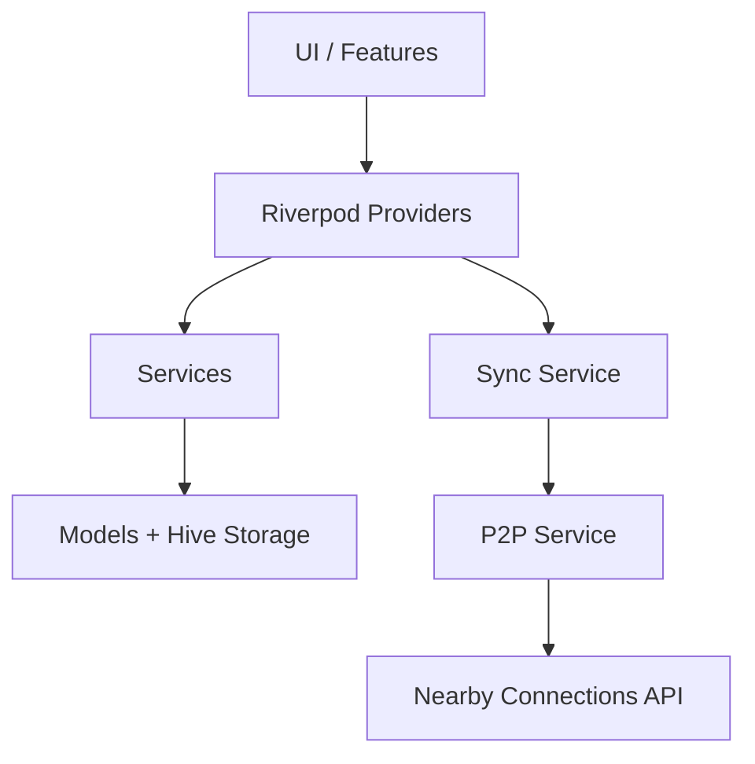

# Trippin — Project Status Report

> **Branch**: `func_touchups` (30 commits, latest work)
> **Last active**: ~April 2026 (based on validation log dates)
> **Stack**: Flutter + Riverpod + Hive + Google Nearby Connections (Android)

---

## 🏗️ Architecture Overview

Three-tier architecture: **Providers → Services → Models**. Offline-first with Hive persistence. P2P via Google Nearby Connections (Android only, single-guest star topology).

---

## ✅ What's Been Implemented

### Phase 0 — Foundation
| Item | Status |
|------|--------|
| Directory structure (`core/`, `features/`, `ui_components/`) | ✅ Done |
| Night Owl dark theme (deep navy, electric purple/blue accents) | ✅ Done |
| `AppLogger` + `safeExecute` error handling utilities | ✅ Done |
| Riverpod `ProviderScope` at root | ✅ Done |

### Phase 1 — Local Mode (Single Device)
| Item | Status |
|------|--------|
| **User model** — UUID, `isDeviceOwner`, `managedBy` (Squad support) | ✅ Done |
| **Trip model** — title, dates, memberIds, expenseIds, joinCode | ✅ Done |
| **Expense model** — payer, amount, beneficiaries, equal split | ✅ Done |
| Hive persistence (StorageService with adapters) | ✅ Done |
| ExpenseService — net balance calculation | ✅ Done |
| Trip/Members/Expenses/Balances providers | ✅ Done |
| Create trip + add members + log expenses + view balances | ✅ Done |

### Phase 1.5 — Trip Closure & History
| Item | Status |
|------|--------|
| Trip close/reopen with `isClosed`, `closedAt` fields | ✅ Done |
| **ExpenseRevision** model — full edit audit trail | ✅ Done |
| **TripHistoryEvent** model — chronological event log | ✅ Done |
| Expense edit/delete with revision history | ✅ Done |
| Trip history list + trip detail screen | ✅ Done |
| Text export (ExportService) — summary, balances, history | ✅ Done |
| Read-only banner when trip is closed | ✅ Done |
| Home screen refactored into `TripScreen` + `EmptyHomeScreen` | ✅ Done |

### Phase 2 — Device Discovery (The Handshake)
| Item | Status |
|------|--------|
| Connection state models (`ConnectionRole`, `ConnectionStatus`) | ✅ Done |
| `P2PService` — advertise/discover/connect/disconnect via Nearby Connections | ✅ Done |
| `PermissionsService` — Bluetooth, location, Wi-Fi runtime checks | ✅ Done |
| `ConnectionProvider` — lifecycle state machine (idle→advertising→connected) | ✅ Done |
| Host lobby screen + Guest scan screen + Connect mode chooser | ✅ Done |
| Android manifest permissions (Nearby, BT, Wi-Fi, Location) | ✅ Done |
| Confirmation dialog on both sides before accepting | ✅ Done |
| Device-lost handling, guest re-scan, app-settings recovery links | ✅ Done |
| SDK-aware permission requests (Android 12/13+ quirks) | ✅ Done |
| **Two-device handshake tested and working** | ✅ Done |

### Phase 3 — Data Sync (Steps 1-5)
| Item | Status |
|------|--------|
| **Step 1**: Sync envelope model + message types (HANDSHAKE, ADD_EXPENSE, SYNC_LEDGER, HEARTBEAT) | ✅ Done |
| **Step 1**: P2P transport wired for payload send/receive | ✅ Done |
| **Step 2**: SyncService scaffold — role-based, envelope parsing, send helpers | ✅ Done |
| **Step 3**: Host ledger loop — local write → broadcast SYNC_LEDGER | ✅ Done |
| **Step 3**: Guest ledger loop — local write → ADD_EXPENSE → reconcile on SYNC_LEDGER | ✅ Done |
| **Step 3**: Guest sends HANDSHAKE on connect with squad info | ✅ Done |
| **Step 4**: Persistent offline queue in Hive (enqueue/flush/remove) | ✅ Done |
| **Step 4**: Auto-flush on reconnect, partial failure resilience | ✅ Done |
| **Step 5**: `expense_sync_status_provider` — pending/retrying/synced states | ✅ Done |
| **Step 5**: Sync status badges in expenses UI | ✅ Done |
| **Step 5**: `ConnectionStatusBanner` component in trip screen | ✅ Done |
| **Step 5**: Queue count visibility in UI | ✅ Done |
| **Step 5**: Guest role restrictions (no add members, no edit/delete, no finish/reopen) | ✅ Done |

### Home Hub + Host/Guest Flow (Phase 3 UX Layer)
| Item | Status |
|------|--------|
| Home Hub with role-first actions (Start Trip as Host / Join Trip) | ✅ Done |
| Dedicated `StartTripScreen` (trip name + host name form) | ✅ Done |
| `JoinTripEntryScreen` — nearby host discovery list | ✅ Done |
| `AddMemberOptionsSheet` — Local Member vs Connect Guest | ✅ Done |
| Trip History one-tap from Home | ✅ Done |

---

## ❌ What's Missing / Incomplete

### Phase 3 Closure (Blocking Phase 4)

| Item | Priority | Notes |
|------|----------|-------|
| **Two-device validation evidence** | 🔴 High | [VALIDATION_LOG.md](file:///d:/Vs%20Code%20Flutter/trippin/trippin/docs/VALIDATION_LOG.md) has all scenarios listed as TODO — never filled in |
| Guest update/delete dedicated payloads | 🟡 Medium | Currently host-authority only via SYNC_LEDGER — no guest edit/delete sync |
| Handshake context persistence | 🟢 Low | Metadata for diagnostics/multi-guest planning |
| Advanced queue retry strategy (backoff) | 🟡 Medium | Currently only reconnect-triggered flush |

### Phase 4 — Settlement & Closure (Not Started)

| Item | Priority | Notes |
|------|----------|-------|
| **"End Trip" protocol** — host locks trip, read-only for all | 🔴 High | Core feature gap |
| **Consensus verification** — VERIFY_TOTAL request to all guests | 🔴 High | Guests confirm final total |
| **Min-Cash-Flow debt simplification algorithm** | 🔴 High | Currently only simple net balances, no transaction minimization |
| **Export/share settlement summary** | 🟡 Medium | Depends on settlement algo; current export is basic text-only |
| Final sync — ensure all devices have exact final dataset | 🔴 High | Part of end-trip protocol |

### Future / Deferred

| Item | Priority |
|------|----------|
| Multi-guest support (fan-out sync for 2+ guests) | 🟡 Medium |
| iOS P2P transport | 🟡 Medium |
| Sync diagnostics & session analytics | 🟢 Low |
| Full join-code/QR admission protocol | 🟡 Medium |
| **Final visual design system pass** | 🟡 Medium |
| Percentage / Shares split modes (only Equal is implemented) | 🟡 Medium |

---

## 🔍 Code Health Observations

1. **`trip_screen.dart` is 28KB / ~800+ lines** — this is the largest file by far. It handles trip display, expense dialogs, member management, connection UI, and action routing all in one widget. Ripe for decomposition.

2. **No tests exist** — zero unit or widget tests across the entire codebase. The ExpenseService balance logic and SyncService envelope handling are critical paths that should have coverage.

3. **No router** — navigation is all `Navigator.push`-based. For the growing feature set (Home Hub, Start Trip, Join Trip, Trip Detail, History, Settings, About, Connection screens), a declarative router (e.g., `go_router`) would improve maintainability.

4. **Split types limited** — only `EQUAL` split is implemented. The `SplitType` enum exists with `percentage` and `shares`, but no logic handles them. This is a significant feature gap for the target use case.

5. **`StorageService` is 21KB** — it's a god-service doing everything. Could benefit from being broken into domain-specific repositories.

6. **Hive adapters are hand-maintained** — schema migration story is fragile. Worth considering for long-term stability.

---

## 🎯 Recommended Next Steps (Priority Order)

### 1. 🧪 Two-Device Validation (Close Phase 3)
**Why first**: Phase 4 depends on stable Phase 3. You can't build settlement on top of sync you haven't validated. You have the [VALIDATION_LOG.md](file:///d:/Vs%20Code%20Flutter/trippin/trippin/docs/VALIDATION_LOG.md) template ready — run through the 4 scenarios with two Android devices, capture evidence, and document results. Fix any bugs found.

### 2. 🧮 Phase 4: Settlement Algorithm + End Trip Protocol
**Why next**: This is the core product value — *"Enjoy the trip, don't stress the bill."* Without settlement, the app is an expense logger, not an expense splitter. The min-cash-flow algorithm is well-documented in [phase4.md](file:///d:/Vs%20Code%20Flutter/trippin/trippin/docs/implementation_overview/phase4.md) and is a purely local computation — no P2P complexity.

### 3. ➗ Additional Split Modes (Percentage + Shares)
**Why**: Equal split only is a dealbreaker for real usage. "I had the boat ride, you just had chai" is the exact scenario from your problem statement. The enum exists — the logic and UI just need to be wired.

### 4. 🎨 Visual Design Pass
**Why**: The UI is functionally complete but utilitarian. Your target audience (Gen-Z, university students) expects polished aesthetics. The [DEFERRED_BACKLOG.md](file:///d:/Vs%20Code%20Flutter/trippin/trippin/docs/DEFERRED_BACKLOG.md) explicitly calls this out as waiting for functional flow stabilization — which is nearly there.

### 5. 🧹 Code Quality
- Break up `trip_screen.dart` into smaller widgets
- Add unit tests for `ExpenseService`, `SyncService`, balance calculations
- Consider `go_router` for navigation
- Split `StorageService` into focused repositories

---

## Questions for You

1. **Have you done any real two-device testing?** The validation log is all TODOs. Did testing happen informally but just wasn't documented? This affects whether we should start with bug-fixing or can move to Phase 4.

2. **What's your priority — shipping a usable MVP or building the complete feature set first?** If MVP, I'd prioritize: settlement algorithm → split modes → polish. If completeness, I'd go: validation → Phase 4 full protocol → multi-guest → polish.

3. **The `func_touchups` branch is where the latest work is — is `main` significantly behind? Should we merge or keep developing here?**

4. **Are you targeting Android-only for now, or is iOS support important for your circle?** This affects whether we invest in cross-platform P2P transport.

5. **Any specific pain points you remember from when you left off?** Anything that was broken or frustrating?
