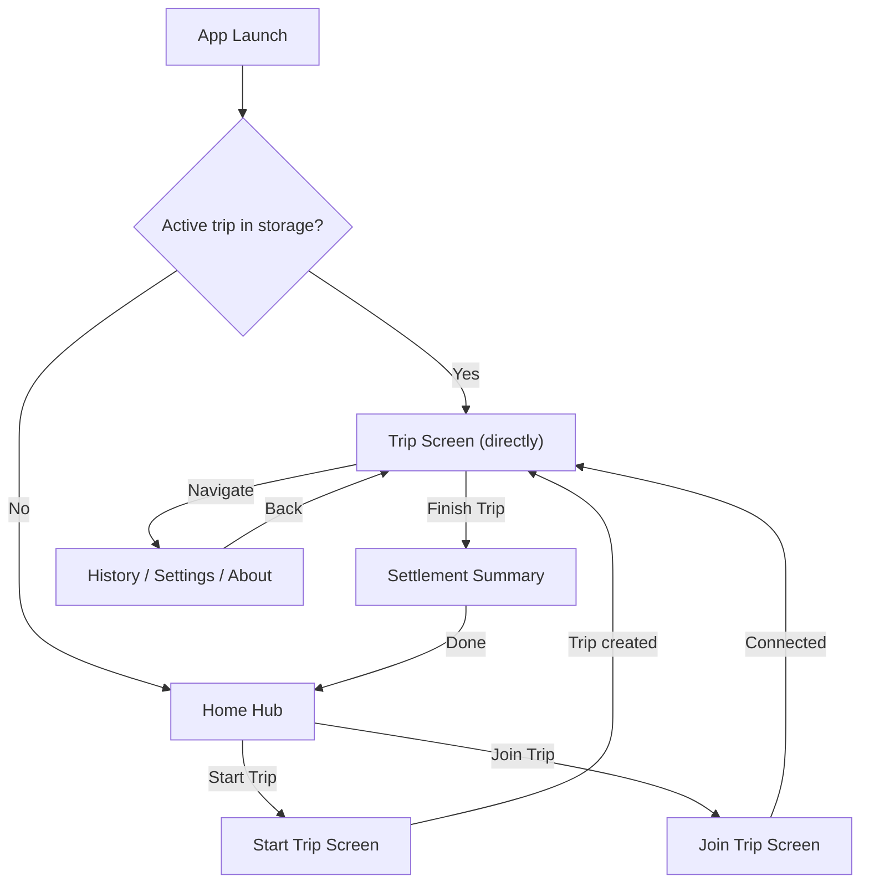
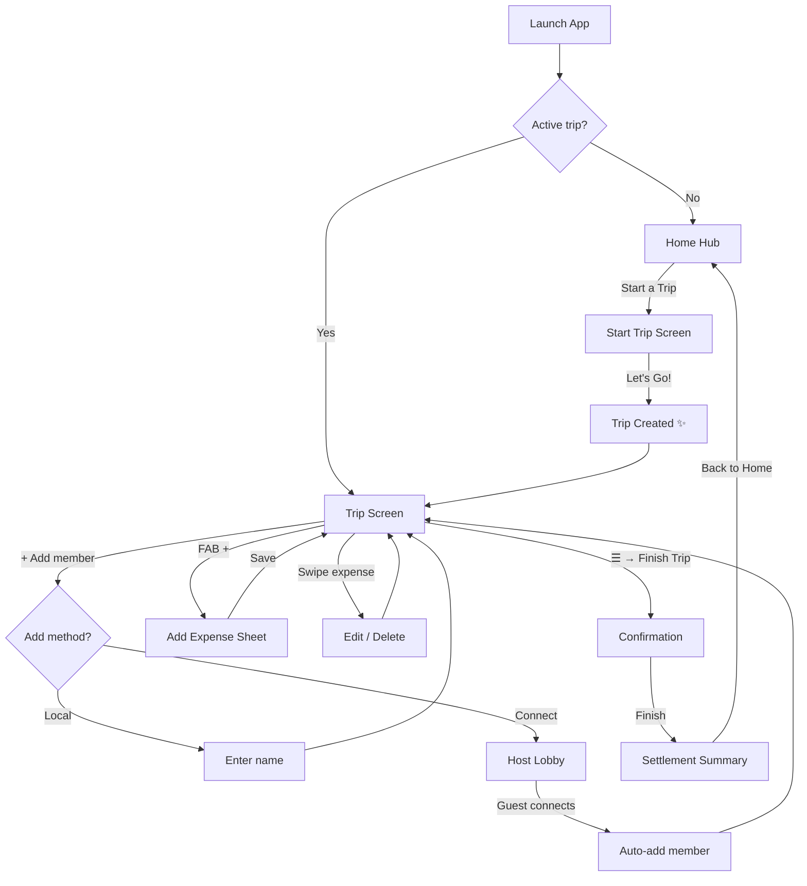
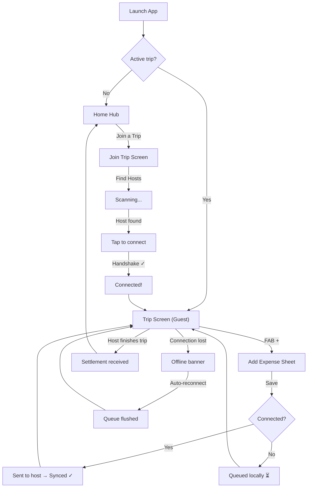
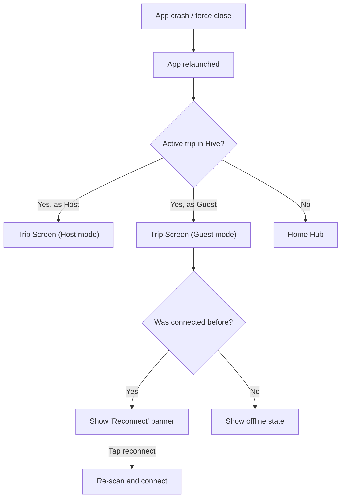

# Trippin — Complete UX/UI Design Specification

> *"Enjoy the trip, don't stress the bill."*

---

## 1. Design Philosophy

### Identity
Trippin is **fast, trustworthy, and fun**. It's the app you pull out at the dhaba when someone yells "who's paying for chai?". It works in the mountains where you have zero signal. It feels like a tool your friend group actually *wants* to use, not another boring finance app.

### Visual Language
| Token | Value | Usage |
|-------|-------|-------|
| Background | `#0B0F1A` (Navy) | Scaffold, main bg |
| Surface | `#121826` (Deep Surface) | Cards, sheets, dialogs |
| Deep BG | `#0A0C14` (Deepest Navy) | AppBar, canvas |
| Primary | `#7C4DFF` (Electric Purple) | CTAs, FAB, active states |
| Secondary | `#3B82F6` (Electric Blue) | Input borders, secondary actions |
| Accent | `#22D3EE` (Neon Cyan) | Highlights, links, sync badges |
| Success | `#4ADE80` (Green) | Synced, positive balances |
| Warning | `#FBBF24` (Amber) | Pending, queued states |
| Error | `#FF6B6B` (Red) | Errors, negative balances, delete |
| Text Primary | `#E6E9F5` | Headings, body text |
| Text Muted | `#9AA4C7` | Subtitles, hints, labels |

### Member Color System
Each member gets assigned a unique color from a curated palette for instant visual identification across the entire app (avatars, expense cards, balance bars, pie charts). Colors are assigned in order of joining:

```
#7C4DFF (Purple), #3B82F6 (Blue), #22D3EE (Cyan), #4ADE80 (Green),
#FBBF24 (Amber), #F97316 (Orange), #EF4444 (Red), #EC4899 (Pink),
#A78BFA (Lavender), #6EE7B7 (Mint)
```

### Typography
- **Headings**: Bold, slightly tracked (+0.5 to +1.2 letter spacing)
- **Body**: Regular weight, clean and readable
- **Numbers/Amounts**: Mono-spaced or tabular figures for alignment (consider using `Google Fonts: Space Grotesk` or `JetBrains Mono` for amounts)
- **Fun Copy**: Casual, slightly cheeky tone — not corporate

### Interaction Principles
1. **Every action has feedback** — haptics on tap, micro-animations on state changes
2. **Swipe gestures** on list items (swipe left to delete, swipe right to edit)
3. **Pull-to-refresh** with a custom animation (a spinning compass or trip icon)
4. **Smooth page transitions** — slide-up for sheets, fade-through for navigation
5. **Celebration moments** — confetti or a fun animation when a trip is created or finished

---

## 2. App Session Model

This is the most important behavioral change from the current implementation.

### The Rule: Active Trip = Locked Session



**Key behaviors:**
- If you have an active trip (as host OR guest) and open the app → **go directly to Trip Screen**. No home screen.
- The Home Hub is ONLY visible when there is NO active trip.
- From the Trip Screen, you CAN navigate to History/Settings/About via a drawer or overflow menu, but pressing back always returns to the Trip Screen — you can't escape to Home until the trip is ended.
- **App crash / force close / phone dies** → Relaunch → Straight back to Trip Screen. The trip persists in Hive.
- Guest session: when a guest is connected and the guest closes the app, on relaunch they should see the trip data they had last received, with a "Reconnect" prompt at the top.

### What Changes From Current Code
Currently, `HomeScreen` watches `tripControllerProvider` and shows `TripScreen` inline or `EmptyHomeScreen`. This needs to change so that:
1. The active trip check happens at the **router/app level**, not inside HomeScreen
2. TripScreen becomes a **top-level route**, not a child of HomeScreen
3. Navigation from TripScreen to History/Settings uses overlay navigation, not replacement

---

## 3. Screen-by-Screen Specification

---

### 3.1 — Home Hub (No Active Trip)

**When visible:** Only when there is NO active trip in storage.

**Layout:**

```
┌─────────────────────────────────────┐
│                                     │
│          (subtle glow aura)         │
│                                     │
│            ✈  TRIPPIN               │
│     "Split bills, not friendships"  │
│                                     │
│  ┌─────────────────────────────┐    │
│  │  🚀  Start a Trip           │    │  ← Primary CTA (Electric Purple, full-width)
│  └─────────────────────────────┘    │
│                                     │
│  ┌─────────────────────────────┐    │
│  │  🔗  Join a Trip            │    │  ← Secondary CTA (Outlined, Neon Cyan)
│  └─────────────────────────────┘    │
│                                     │
│         ─── or ───                  │
│                                     │
│   📋 History    ⚙ Settings    ℹ️ About  │  ← Pill buttons, horizontal row
│                                     │
│                                     │
│  "Works offline. No sign-up needed."│  ← Muted footer text
│                                     │
└─────────────────────────────────────┘
```

**Details:**
- **App logo area**: "TRIPPIN" in bold display text with a subtle animated gradient glow behind it (purple ↔ blue breathing animation, ~4s cycle). A small plane/compass icon above it.
- **"Split bills, not friendships"** — tagline in muted text.
- **Start a Trip**: Full-width elevated button, Electric Purple. Icon: rocket or flag. This is THE primary action.
- **Join a Trip**: Full-width outlined button, Neon Cyan border. Icon: link or group_add.
- **Divider**: A subtle "or" divider between primary actions and secondary nav.
- **Secondary pills**: Compact chip/pill buttons for History, Settings, About. Same style as current `ActionPill`.
- **Footer**: Muted text reinforcing offline-first nature.
- **No "Create sample trip" button**: Remove this from the main screen. Move it to Settings → Developer/Debug section if needed, or remove entirely.

**Micro-animations:**
- Logo glow pulses subtly on loop
- Buttons have a scale-down (0.97) + haptic on press
- Pills have a subtle color fill on hover/press

---

### 3.2 — Start Trip Screen

**Purpose:** Create a new trip. You become the host.

**Layout:**

```
┌─────────────────────────────────────┐
│  ← Back       Start a Trip         │
│─────────────────────────────────────│
│                                     │
│  "Name your adventure"              │  ← Section label, muted
│                                     │
│  ┌─────────────────────────────┐    │
│  │  Trip Name                  │    │  ← Text field
│  │  e.g. "Khanpur Dam Weekend" │    │
│  └─────────────────────────────┘    │
│                                     │
│  "What should we call you?"         │
│                                     │
│  ┌─────────────────────────────┐    │
│  │  Your Name                  │    │  ← Text field, auto-filled if returning user
│  │  e.g. "Rafay"               │    │
│  └─────────────────────────────┘    │
│                                     │
│  💡 "You'll be the host. You can    │
│   add members and manage expenses   │
│   once the trip is created."        │
│                                     │
│                                     │
│  ┌─────────────────────────────┐    │
│  │  🚀  Let's Go!              │    │  ← Full-width primary button
│  └─────────────────────────────┘    │
│                                     │
└─────────────────────────────────────┘
```

**Details:**
- **Your Name field**: Should auto-fill with the name used in the user's last trip (persisted in local storage). First-time users fill it in manually. This avoids asking for name every single time.
- **Placeholder text**: Use fun, relatable examples — "Khanpur Dam Weekend", "GIKI Farewell", "Naran Road Trip"
- **Info box**: A subtle card with a lightbulb icon explaining what being a host means. Casual copy.
- **Let's Go!**: On tap → creates trip → animated transition to Trip Screen. Maybe a quick "confetti burst" or "checkmark animation" before transitioning.
- **Validation**: Both fields required. Show inline error text if empty on submit.

**What changes from current:**
- Remove the dry description text "Create your trip and become the host. As host, you control the lobby..."
- Add placeholder examples, auto-fill name, fun copy
- After creation, navigate directly (not pop back to home and let it re-route)

---

### 3.3 — Join Trip Screen

**Purpose:** Find a nearby host and join their trip as a guest.

**Layout:**

```
┌─────────────────────────────────────┐
│  ← Back       Join a Trip          │
│─────────────────────────────────────│
│                                     │
│  "Enter your name"                  │
│                                     │
│  ┌─────────────────────────────┐    │
│  │  Your Name                  │    │  ← Auto-filled if returning user
│  │  e.g. "Ali"                 │    │
│  └─────────────────────────────┘    │
│                                     │
│        ┌───────────────┐            │
│        │  📡 Find Hosts │            │  ← Primary button, starts scan
│        └───────────────┘            │
│                                     │
│  ─── Nearby Hosts ───               │
│                                     │
│  ┌─────────────────────────────┐    │
│  │  📱  Rafay's Trip            │    │  ← Discovered host card
│  │     "Khanpur Dam Weekend"    │    │
│  │     Tap to connect →         │    │
│  └─────────────────────────────┘    │
│                                     │
│  ┌─────────────────────────────┐    │
│  │  📱  Saad's Trip             │    │
│  │     "Naran 2026"             │    │
│  │     Tap to connect →         │    │
│  └─────────────────────────────┘    │
│                                     │
│                                     │
│  💡 "Make sure the host has their   │
│   lobby open and you're nearby.     │
│   Keep Bluetooth & Location on."    │
│                                     │
└─────────────────────────────────────┘
```

**States:**
1. **Initial**: Name field + "Find Hosts" button + info text
2. **Scanning**: Button changes to "Scanning..." with a pulsing radar/sonar animation. The area below shows a subtle animated ripple effect.
3. **Hosts Found**: Cards appear with slide-up animation. Each card shows the host's display name and trip name.
4. **Empty After Scan**: "No hosts found nearby. Make sure the host has their lobby open." + "Try Again" button
5. **Connecting**: After tapping a host card, show a connection handshake animation (two phones connecting with a line). Both devices show confirmation dialogs.
6. **Connected**: Brief success state ("Connected! 🎉") → auto-navigate to Trip Screen as guest.

**Important changes from current:**
- Add guest name input BEFORE scanning (this name is sent during handshake)
- Show trip name alongside host name in discovered list (requires the host to broadcast trip name in their advertising payload — minor P2P change)
- Don't just pop back on connection request — stay on screen and show progress, then navigate to Trip Screen on confirmed connection
- Add the radar animation during discovery for visual feedback

---

### 3.4 — Trip Screen (The Main Experience)

This is where users spend 90% of their time. It needs to be **information-dense but not cluttered**, **fun but functional**.

**Architecture:** The Trip Screen uses a **tabbed layout** with a persistent header and a prominent FAB.

```
┌─────────────────────────────────────┐
│  ☰                    ⟳   •••     │  ← Hamburger (nav drawer), Refresh, Overflow
│─────────────────────────────────────│
│                                     │
│  🏔️ Khanpur Dam Weekend             │  ← Trip title, large
│  Started 2 hours ago • 5 members    │  ← Subtitle: duration + count
│                                     │
│  ┌─────────────────────────────┐    │
│  │  Total Spent                 │    │
│  │      ₨ 12,450               │    │  ← Big animated number
│  │  Your balance: +₨ 2,100     │    │  ← Personal balance (green/red)
│  └─────────────────────────────┘    │
│                                     │
│  👤👤👤👤👤  + Add                  │  ← Horizontal avatar strip
│                                     │
│  ┌──────────┬──────────┬──────────┐ │
│  │ Expenses │ Balances │ Activity │ │  ← Tab bar
│  └──────────┴──────────┴──────────┘ │
│                                     │
│  ┌─────────────────────────────┐    │
│  │  🍕 Lunch at Dhaba           │    │
│  │  Rafay paid ₨ 1,200         │    │  ← Expense card
│  │  Split: Everyone (5)  • 2m  │    │
│  └─────────────────────────────┘    │
│  ┌─────────────────────────────┐    │
│  │  ⛽ Fuel                     │    │
│  │  Ali paid ₨ 3,500           │    │
│  │  Split: Rafay, Ali  • 15m   │    │
│  └─────────────────────────────┘    │
│                                     │
│                          [+ Add]    │  ← FAB (Electric Purple, pulsing glow)
└─────────────────────────────────────┘
```

#### 3.4.1 — Trip Header (Always visible, above tabs)

| Element | Details |
|---------|---------|
| **Trip Title** | Large heading. The trip name. |
| **Subtitle** | "Started X ago • N members". Updates live. |
| **Total Spent Card** | Glassmorphic card showing total with a subtle gradient. The number should animate up when expenses are added (count-up animation). |
| **Your Balance** | Shows the device owner's net position. Green if positive (owed money), red if negative (owes money). |
| **Member Avatar Strip** | Horizontal scroll of circular avatars. Each avatar shows the member's initial + their assigned color. The `+ Add` button at the end opens the Add Member flow (host only). Tapping an avatar could show a quick popover with that member's balance. |

#### 3.4.2 — Connection Status Strip

A thin banner below the header, always visible when connected or when issues exist:

| State | Appearance |
|-------|------------|
| **Not connected (host, no guests)** | Muted strip: "No guests connected" with a "Open Lobby" action |
| **Connected** | Green strip: "🟢 Connected to Ali" |
| **Guest disconnected** | Amber strip: "⚠️ Connection lost • N items queued" |
| **Syncing** | Blue strip with spinner: "Syncing..." |

For guests:
| State | Appearance |
|-------|------------|
| **Connected to host** | Green: "🟢 Connected to Rafay's trip" |
| **Disconnected** | Amber: "⚠️ Offline • N expenses queued" with "Reconnect" button |
| **Synced** | Brief green flash: "✓ All synced" then fades to connected state |

#### 3.4.3 — Expenses Tab

The default tab. Shows all expenses in reverse chronological order.

**Expense Card Design:**
```
┌─────────────────────────────────────┐
│  🟣                                 │
│  🍕  Lunch at Dhaba          ₨1,200│  ← Category icon + name + amount
│  Rafay paid • Split: Everyone  2m  │  ← Payer + split info + time ago
│  ──────────────────────────────     │
│  Rafay  Ali  Saad  Hassan  Usman   │  ← Beneficiary avatars (small, colored dots)
│                              ✓ Synced│  ← Sync badge (guest only)
└─────────────────────────────────────┘
```

- **Left color bar**: Thin vertical strip in the payer's assigned color
- **Swipe left**: Delete (red background with trash icon) — host only
- **Swipe right**: Edit (blue background with pencil icon) — host only
- **Tap**: Opens expense detail sheet showing full breakdown
- **Sync badge**: Only visible for guests. Shows Pending (amber) / Synced (green) / Queued (amber with retry icon)

**Empty state:** "No expenses yet. Tap + to log your first one."

#### 3.4.4 — Balances Tab

Shows who owes whom in a clean, visual format.

```
┌─────────────────────────────────────┐
│  Net Balances                       │
│                                     │
│  🟣 Rafay         ───────── +₨2,100│  ← Green bar extending right
│  🔵 Ali           ──────    +₨  800│
│  🟢 Saad          ───  ──── -₨1,500│  ← Red bar extending left
│  🟡 Hassan              ── -₨  900│
│  🟠 Usman         ─         -₨  500│
│                                     │
│  ─────────────────────────────────  │
│                                     │
│  Simplified Settlements             │
│                                     │
│  Saad  ──₨1,500──→  Rafay          │  ← Settlement arrows
│  Hassan ──₨600──→   Rafay          │  ← (when implemented)
│  Hassan ──₨300──→   Ali            │
│  Usman  ──₨500──→   Ali            │
│                                     │
│  "3 transfers to settle up"         │
│                                     │
└─────────────────────────────────────┘
```

- **Balance bars**: Horizontal bars showing positive (green, right) and negative (red, left) amounts. Proportional to the max balance.
- **Settlement section**: Shows the min-cash-flow simplified transfers. This is a Phase 4 feature, so initially show only the balance bars with a "Settlement coming soon" placeholder.
- **Tapping a member**: Shows their expense breakdown.

#### 3.4.5 — Activity Tab

A chronological timeline of everything that happened during the trip.

```
┌─────────────────────────────────────┐
│  Activity                           │
│                                     │
│  ● 2m ago    Rafay added expense    │
│              "Lunch at Dhaba"       │
│                                     │
│  ● 15m ago   Ali added expense      │
│              "Fuel"                 │
│                                     │
│  ● 30m ago   Hassan joined trip     │
│                                     │
│  ● 1h ago    Trip created           │
│              "Khanpur Dam Weekend"  │
│                                     │
└─────────────────────────────────────┘
```

- Uses existing `TripHistoryEvent` model
- Timeline dots colored by event type (green for additions, blue for edits, red for deletions)
- Shows human-readable relative timestamps

#### 3.4.6 — Floating Action Button (FAB)

The main "Add Expense" FAB. Always visible on the Expenses tab.

- **Appearance**: Electric Purple circle with `+` icon. Has a subtle pulsing glow animation to draw attention.
- **Position**: Bottom-right, standard FAB position.
- **Behavior**: Opens the Add Expense Sheet (bottom sheet, not dialog).
- **On other tabs**: FAB could either hide (Balances/Activity tabs) or remain but with different action context.

#### 3.4.7 — Navigation Drawer (☰)

Accessible from the hamburger icon in the Trip Screen AppBar. Provides access to secondary screens without leaving the trip:

```
┌──────────────────────┐
│                      │
│  ✈  TRIPPIN          │
│  Khanpur Dam Weekend │
│  Host: Rafay         │
│                      │
│  ────────────────    │
│                      │
│  📋  Trip History    │
│  📡  Connection      │  ← Opens connection management
│  ⚙️  Settings        │
│  ℹ️  About           │
│                      │
│  ────────────────    │
│                      │
│  🏁 Finish Trip      │  ← Host only, prominent action
│                      │
└──────────────────────┘
```

- Guest sees the same drawer but without "Finish Trip" and without "Connection" management (they see connection status in the strip instead).

---

### 3.5 — Add Expense Sheet

**Triggered by:** FAB tap on Trip Screen.
**Type:** Full-screen bottom sheet (draggable, slides up from bottom).

This replaces the current `AlertDialog`-based expense form with a proper sheet.

```
┌─────────────────────────────────────┐
│  ── drag handle ──                  │
│                                     │
│  Add Expense                    ✕   │
│                                     │
│  ┌─────────────────────────────┐    │
│  │  ₨                          │    │
│  │       0.00                   │    │  ← BIG amount input, centered, auto-focus
│  └─────────────────────────────┘    │
│                                     │
│  ┌─────────────────────────────┐    │
│  │  What was it for?           │    │  ← Description field
│  │  e.g. "Fuel", "Lunch"       │    │
│  └─────────────────────────────┘    │
│                                     │
│  Who paid?                          │
│  ┌──┐ ┌──┐ ┌──┐ ┌──┐ ┌──┐         │
│  │R │ │A │ │S │ │H │ │U │         │  ← Horizontal member chips (tap to select)
│  └──┘ └──┘ └──┘ └──┘ └──┘         │
│   ✓                                 │  ← Selected chip is highlighted
│                                     │
│  Split between                      │
│  ┌──┐ ┌──┐ ┌──┐ ┌──┐ ┌──┐         │
│  │R │ │A │ │S │ │H │ │U │         │  ← Multi-select chips (all selected by default)
│  └──┘ └──┘ └──┘ └──┘ └──┘         │
│  ✓    ✓    ✓    ✓    ✓    All ↺    │  ← "All" toggle to select/deselect all
│                                     │
│  ┌─────────────────────────────┐    │
│  │  📝 Note (optional)         │    │  ← Collapsible/optional field
│  └─────────────────────────────┘    │
│                                     │
│  Each person owes: ₨ 240           │  ← Live split preview
│                                     │
│  ┌─────────────────────────────┐    │
│  │  ✓  Save Expense             │    │  ← Full-width save button
│  └─────────────────────────────┘    │
│                                     │
└─────────────────────────────────────┘
```

**Key design decisions:**
1. **Amount field is FIRST and BIG** — this is the most important input. Large, centered, with a currency symbol. Auto-focused on open.
2. **Member selection uses chips, not checkboxes** — compact, colorful, tap-friendly. Each chip shows the member's initial in their assigned color.
3. **Payer defaults to device owner** (the person holding the phone).
4. **Beneficiaries default to ALL members** — most expenses are shared. Tapping toggles individual members. "All" button resets to everyone.
5. **Live split preview** — "Each person owes: ₨ X" updates as you change amount or beneficiaries. Gives immediate feedback.
6. **Note field is collapsed by default** — tap to expand. Reduces visual clutter for quick expense logging.

**Quick-add flow:** For rapid logging, only the amount and description are required. Payer defaults to you, split defaults to everyone. Two taps: enter amount → save.

---

### 3.6 — Add Member Flow

**Triggered by:** `+ Add` button on the member avatar strip (host only).

**Bottom Sheet Options:**
```
┌─────────────────────────────────────┐
│  ── drag handle ──                  │
│                                     │
│  Add a Member                       │
│                                     │
│  ┌─────────────────────────────┐    │
│  │  👤  Add Locally              │    │
│  │  "For someone without the    │    │
│  │   app — you'll manage their  │    │
│  │   expenses"                  │    │
│  └─────────────────────────────┘    │
│                                     │
│  ┌─────────────────────────────┐    │
│  │  📡  Connect a Device        │    │
│  │  "Invite someone nearby to   │    │
│  │   join with their phone"     │    │
│  └─────────────────────────────┘    │
│                                     │
└─────────────────────────────────────┘
```

- **Add Locally**: Opens a simple name input sheet. One field, one button. Quick and clean.
- **Connect a Device**: Opens the Host Lobby screen where the host starts advertising and waits for a guest to connect. Once connected, the guest is automatically added as a member.

---

### 3.7 — Host Lobby Screen (Connection Management)

**Purpose:** The host opens a lobby for guests to discover and connect.

```
┌─────────────────────────────────────┐
│  ← Back       Your Lobby           │
│─────────────────────────────────────│
│                                     │
│         ╭────────────────╮          │
│         │                │          │
│         │   📡            │          │  ← Animated broadcast waves
│         │   Broadcasting  │          │
│         │                │          │
│         ╰────────────────╯          │
│                                     │
│  Trip: Khanpur Dam Weekend          │
│  Join Code: A3X7K9                  │  ← Displayed for visual verification
│                                     │
│  ─── Connected Guests ───           │
│                                     │
│  (none yet)                         │  ← Or shows connected guest card
│                                     │
│  💡 "Tell your friends to open      │
│   Trippin → Join a Trip and         │
│   look for your lobby."             │
│                                     │
│  ┌─────────────────────────────┐    │
│  │  Stop Lobby                  │    │  ← Outlined button
│  └─────────────────────────────┘    │
│                                     │
└─────────────────────────────────────┘
```

- **Broadcasting animation**: Concentric circles radiating out from a phone icon (think sonar/radar)
- **Incoming request**: When a guest requests connection, a prominent dialog slides in showing the guest's name + a verification code. Host taps Accept/Reject.
- **After connection**: Guest card appears in the "Connected Guests" section. The guest is automatically added to the trip's member list. Show a "✓ Ali connected and added" confirmation.

---

### 3.8 — Trip Closure Flow

**Triggered by:** "Finish Trip" in the navigation drawer (host only).

**Step 1 — Confirmation Dialog:**
```
┌─────────────────────────────────────┐
│                                     │
│  🏁 Finish Trip?                    │
│                                     │
│  This will lock the trip. No more   │
│  expenses can be added.             │
│                                     │
│  ⚠️ 2 unsynced items remaining     │  ← Warning if applicable
│                                     │
│  [Cancel]              [Finish]     │
│                                     │
└─────────────────────────────────────┘
```

**Step 2 — Settlement Summary Screen:**
After finishing, navigate to a full-screen settlement summary:

```
┌─────────────────────────────────────┐
│           Trip Complete! 🎉         │
│─────────────────────────────────────│
│                                     │
│  Khanpur Dam Weekend                │
│  5 members • 12 expenses            │
│                                     │
│  ┌─────────────────────────────┐    │
│  │  Total Spent: ₨ 12,450      │    │
│  └─────────────────────────────┘    │
│                                     │
│  Settlements                        │
│                                     │
│  Saad  ──₨1,500──→  Rafay          │
│  Hassan ──₨900───→  Rafay           │
│  Usman  ──₨500──→  Ali             │
│                                     │
│  "3 transfers to settle up"         │
│                                     │
│  ┌─────────────────────────────┐    │
│  │  📤  Share Summary           │    │  ← Share via system sheet
│  └─────────────────────────────┘    │
│  ┌─────────────────────────────┐    │
│  │  📋  Copy as Text            │    │
│  └─────────────────────────────┘    │
│  ┌─────────────────────────────┐    │
│  │  🏠  Back to Home            │    │  ← Returns to Home Hub
│  └─────────────────────────────┘    │
│                                     │
└─────────────────────────────────────┘
```

- **Settlement arrows**: Visual representation of who pays whom
- **Share button**: Uses system share sheet to send settlement text via WhatsApp/SMS
- **Copy as text**: Copies formatted settlement to clipboard
- **Back to Home**: Clears active trip session, returns to Home Hub

---

### 3.9 — Trip History Screen

**Accessed from:** Home Hub pills, or Trip Screen drawer.

```
┌─────────────────────────────────────┐
│  ← Back       Trip History         │
│─────────────────────────────────────│
│                                     │
│  ┌─────────────────────────────┐    │
│  │  🏔️ Khanpur Dam Weekend      │    │
│  │  May 28, 2026 • 5 members   │    │
│  │  ₨ 12,450 • Finished ✓      │    │
│  └─────────────────────────────┘    │
│                                     │
│  ┌─────────────────────────────┐    │
│  │  🏖️ Naran Road Trip          │    │
│  │  Mar 15, 2026 • 3 members   │    │
│  │  ₨ 8,200 • Finished ✓       │    │
│  └─────────────────────────────┘    │
│                                     │
│  ┌─────────────────────────────┐    │
│  │  ☕ GIKI Farewell             │    │
│  │  Jan 20, 2026 • 8 members   │    │
│  │  ₨ 4,500 • Finished ✓       │    │
│  └─────────────────────────────┘    │
│                                     │
└─────────────────────────────────────┘
```

- **Empty state**: "No trips yet. Start one from the home screen!"
- **Swipe left to delete** with confirmation
- **Tap** → Trip Detail Screen (read-only)

---

### 3.10 — Trip Detail Screen (History View)

**Purpose:** View a past trip's data in read-only mode. Reuses the Trip Screen layout but with everything locked.

Same tabbed layout as Trip Screen (Expenses / Balances / Activity) but:
- No FAB
- No add/edit/delete actions
- "Reopen Trip" option in overflow menu (host only)
- "Share Summary" and "Export" options available

---

### 3.11 — Settings Screen

```
┌─────────────────────────────────────┐
│  ← Back       Settings             │
│─────────────────────────────────────│
│                                     │
│  Profile                            │
│  ┌─────────────────────────────┐    │
│  │  Your Name: Rafay          ✏️│    │  ← Editable, persisted
│  └─────────────────────────────┘    │
│                                     │
│  Appearance                         │
│  ┌─────────────────────────────┐    │
│  │  Theme: Night Owl      🌙   │    │  ← For now just shows current
│  └─────────────────────────────┘    │
│                                     │
│  Data                               │
│  ┌─────────────────────────────┐    │
│  │  ⚠️ Reset All Data           │    │  ← Dangerous, needs double confirm
│  └─────────────────────────────┘    │
│                                     │
│  About                              │
│  ┌─────────────────────────────┐    │
│  │  Version 0.1.0               │    │
│  │  Made with ☕ in Pakistan     │    │
│  └─────────────────────────────┘    │
│                                     │
└─────────────────────────────────────┘
```

- Remove the "Connect Devices" entry from Settings — it now lives in the trip flow
- Add profile name persistence
- Add data reset with double confirmation ("Are you sure?" → "This will delete ALL trips and expenses. Type DELETE to confirm.")

---

## 4. Complete User Flow Diagrams

### 4.1 — Host Complete Journey



### 4.2 — Guest Complete Journey



### 4.3 — App Crash Recovery



---

## 5. Expense Categories (Enhancement)

Add pre-defined expense categories with icons and colors for quick visual identification:

| Category | Icon | Example |
|----------|------|---------|
| Food & Drinks | 🍕 | Lunch, chai, snacks |
| Transport | ⛽ | Fuel, toll, parking |
| Stay | 🏠 | Hotel, campsite |
| Activities | 🎯 | Boat ride, entry ticket |
| Shopping | 🛍️ | Souvenirs, supplies |
| Other | 📦 | Miscellaneous |

- Category selection in the Add Expense sheet (optional, defaults to "Other")
- Category icon shows on expense cards
- Future: filter expenses by category

---

## 6. Micro-Animations & Delight

| Trigger | Animation |
|---------|-----------|
| Trip created | Confetti burst + checkmark |
| Expense added | Card slides in from bottom with a "pop" |
| Member added | Avatar pops into the strip with a bounce |
| Sync complete | Green flash wave across the expense card |
| Amount input | Numbers count up smoothly |
| Tab switch | Smooth crossfade between tab content |
| Pull to refresh | Custom spinning compass icon |
| Swipe to delete | Red reveal with trash icon, card slides out |
| Connection established | Two phone icons connecting with a line animation |
| Trip finished | Trophy animation + celebration particles |
| FAB | Subtle breathing glow (2s cycle) |
| Empty states | Gentle floating illustration/icon |

---

## 7. Edge Cases & Error Handling

| Scenario | Handling |
|----------|----------|
| **Host app crashes mid-trip** | Trip persists in Hive. Relaunch → Trip Screen. Guests see "Host disconnected". Re-advertising resumes when host taps "Open Lobby" again. |
| **Guest app crashes** | Trip data persists locally. Relaunch → Trip Screen with "Reconnect" banner. Queued items preserved. |
| **No members yet, user taps Add Expense** | Show snackbar: "Add at least one member first" |
| **All beneficiaries deselected** | Disable save button. Show hint: "Select at least one person" |
| **Amount is 0 or negative** | Disable save button. Show inline validation error. |
| **Duplicate member name** | Allow it (people have same names). Differentiate by color/avatar. |
| **Very long trip name** | Truncate with ellipsis in header, show full in detail. Max 50 chars input. |
| **20+ members** | Avatar strip scrolls horizontally. Expense beneficiary chips wrap to multiple lines. |
| **100+ expenses** | Lazy-load expense list. Show "Load more" or infinite scroll. |
| **Permission denied (BT/Location)** | Show recovery screen with "Open Settings" action and visual guide. |
| **No hosts found after 30s** | Show "No hosts found" with retry button and troubleshooting tips. |
| **Guest tries restricted action** | Grayed-out button with a muted label explaining why. On tap: brief tooltip "Only the host can do this". No snackbar spam. |

---

## 8. What to Remove / Deprecate

| Current Feature | Action | Reason |
|-----------------|--------|--------|
| "Create sample trip" button | **Remove from Home Hub** | Clutters the main screen. Move to Settings→Debug if needed. |
| ConnectScreen (Host/Guest chooser) | **Remove as standalone** | Connection now lives inside the trip flow. Host starts lobby from trip, Guest joins from Join Trip screen. |
| Settings → Connect Devices | **Remove** | Same reason — connection is in-trip now. |
| AlertDialog-based expense forms | **Replace with bottom sheets** | Dialogs feel cramped and dated. Sheets give more room and better UX. |
| "Phase 2 Handshake" text | **Remove all phase references** | Users shouldn't see implementation details in the UI. |
| Explicit refresh button in AppBar | **Keep but secondary** | Pull-to-refresh is primary. Refresh icon can stay in overflow menu. |

---

## 9. Data Model Changes Needed

### User Model — Add persistent profile fields
```dart
// New fields on User or new ProfileConfig model persisted separately
String? savedOwnerName;     // Auto-fill on Start Trip / Join Trip
int colorIndex;             // Assigned member color (0-9)
```

### Trip Model — Add role tracking
```dart
// Track whether this device is host or guest for this trip
// Needed for crash recovery — know which mode to restore
@HiveField(10)
final String? deviceRole;   // 'host' | 'guest' | null
```

### Expense Model — Add category
```dart
@HiveField(10)
final String? category;     // 'food', 'transport', 'stay', 'activities', 'shopping', 'other'
```

---

## 10. Implementation Priority

### Sprint 1: Core Flow Restructure
1. Implement app-level active trip routing (bypass Home when trip active)
2. Redesign Home Hub with new layout, remove sample trip button
3. Redesign Start Trip screen with auto-fill, fun copy, placeholder examples
4. Add persistent profile name storage
5. Add navigation drawer to Trip Screen

### Sprint 2: Trip Screen Overhaul
1. Break up `trip_screen.dart` into proper sub-widgets
2. Implement tabbed layout (Expenses / Balances / Activity)
3. Implement member avatar strip with assigned colors
4. Implement trip header with total + personal balance
5. Replace AlertDialog expense forms with bottom sheets

### Sprint 3: Add Expense Sheet Redesign
1. Build the full-screen bottom sheet for adding expenses
2. Implement chip-based member selection (payer + beneficiaries)
3. Add live split preview calculation
4. Add expense categories (optional enhancement)
5. Implement swipe-to-edit and swipe-to-delete on expense cards

### Sprint 4: Join Trip & Connection Polish
1. Redesign Join Trip screen with name input + radar animation
2. Redesign Host Lobby with broadcast animation
3. Remove standalone Connect Screen and Settings connection entry
4. Ensure trip name is broadcast during discovery (P2P payload change)
5. Add connection status strip to trip header

### Sprint 5: Closure & History
1. Implement Settlement Summary screen after trip finish
2. Redesign Trip History screen with cards
3. Update Trip Detail screen to use new tabbed layout (read-only)
4. Add share/export actions to settlement
5. Add reopen trip flow

### Sprint 6: Polish & Delight
1. Implement all micro-animations (confetti, card pop, glow, etc.)
2. Add haptic feedback on interactions
3. Custom pull-to-refresh animation
4. Empty state illustrations
5. Edge case handling and error states
6. Typography refinement and spacing pass

---

## 11. Open Design Decisions

> [!IMPORTANT]
> These need your input before implementation starts.

1. **Currency**: Should amounts show `₨` (PKR) prefix, or should currency be configurable? For MVP, hardcoding PKR seems fine since the target is Pakistani students.

2. **Expense categories**: Should we implement categories in Sprint 3, or defer to later? They add polish but aren't strictly needed for the core flow.

3. **Member removal**: Can a host remove a member from a trip? What happens to their expenses? This isn't in the current spec at all.

4. **Multiple active trips**: Should a user be able to host one trip and be a guest in another simultaneously? Current model is one active trip at a time. I'd recommend keeping it single-trip for now — it massively simplifies the UX and code.

5. **Notification sounds / haptics**: How aggressive should feedback be? Subtle (iOS-style) or fun/gamified (like adding coins in a game)?

6. **Onboarding**: Should there be a first-time walkthrough (2-3 slides: "This is Trippin → It works offline → Start your first trip")? Or just dive straight in?

7. **Trip theme/cover**: You have a `coverImagePath` field on Trip. Should we let users pick a trip cover photo/color? Nice-to-have or important for the vibe?
